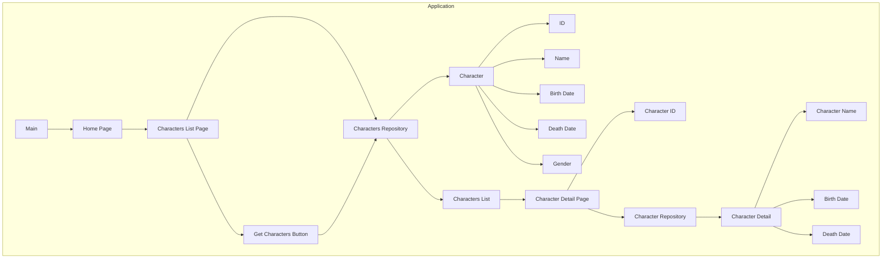

Here is the Mermaid syntax visualization of the input:

VISUAL EXPLANATION:
* The application starts with the Main page, which navigates to the Home Page.
* The Home Page navigates to the Characters List Page, which interacts with the Characters Repository.
* The Characters Repository retrieves a list of Characters, each with an ID, Name, Birth Date, Death Date, and Gender.
* The Characters List Page displays the list of Characters and allows the user to navigate to the Character Detail Page.
* The Character Detail Page retrieves the Character Detail from the Character Repository using the Character ID.
* The Character Detail Page displays the Character Name, Birth Date, and Death Date.

Note: The visualization focuses on the main components and their relationships, omitting some details for simplicity.
